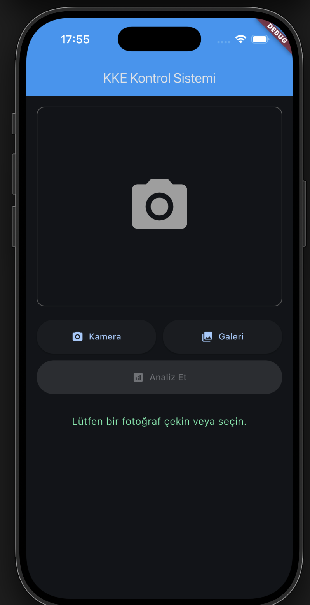

# 🦺 KKE Denetim Sistemi (PPE Detection System)

Kişisel Koruyucu Ekipman (KKE) tespiti için yapay zeka destekli mobil uygulama ve yönetim paneli.
🇹🇷


## 📋 İçindekiler

- [Özellikler](#-özellikler)
- [Teknolojiler](#-teknolojiler)
- [Kurulum](#-kurulum)
- [Kullanım](#-kullanım)
- [Proje Yapısı](#-proje-yapısı)
- [API Dokümantasyonu](#-api-dokümantasyonu)
- [Katkıda Bulunma](#-katkıda-bulunma)
- [Lisans](#-lisans)

## ✨ Özellikler

### 📱 Mobil Uygulama (Flutter)
- ✅ Kamera ile anlık fotoğraf çekme
- ✅ Galeriden fotoğraf seçme
- ✅ Gerçek zamanlı KKE tespiti
- ✅ Kask ve yelek kontrolü
- ✅ Detaylı sonuç gösterimi
- ✅ iOS ve Android desteği

### 🖥️ Admin Dashboard (Web)
- ✅ Gerçek zamanlı istatistikler
- ✅ Grafik ve raporlar (Pasta, Bar, Çizgi, Radar)
- ✅ PDF ve Excel export
- ✅ Kontrol geçmişi
- ✅ Uygunluk oranı takibi

### 🤖 Backend (Python + Flask)
- ✅ YOLO v8 tabanlı nesne tespiti
- ✅ Görüntü kalitesi kontrolü
- ✅ Otomatik görüntü iyileştirme
- ✅ SQLite veritabanı
- ✅ RESTful API
- ✅ EXIF orientation düzeltmesi

## 🛠️ Teknolojiler

### Frontend (Mobile)
- **Flutter** 3.x
- **Dart** 3.x
- **image_picker** - Kamera/Galeri erişimi
- **http** - API iletişimi

### Backend
- **Python** 3.8+
- **Flask** - Web framework
- **Ultralytics YOLO** v8 - Nesne tespiti
- **OpenCV** - Görüntü işleme
- **Pillow** - Görüntü manipülasyonu
- **SQLite** - Veritabanı

### Dashboard
- **HTML5/CSS3/JavaScript**
- **Chart.js** - Grafikler
- **jsPDF** - PDF export
- **SheetJS** - Excel export

## 📦 Kurulum

### Gereksinimler
- Python 3.8+
- Flutter 3.x
- iOS: Xcode 14+
- Android: Android Studio

### Backend Kurulumu

```bash
# Repository'yi klonlayın
git clone https://github.com/yourusername/ppe-detection-app.git
cd ppe-detection-app

# Backend bağımlılıklarını yükleyin
cd backend
pip install -r requirements.txt

# Backend'i başlatın
python3 app.py
```

Backend `http://localhost:5001` adresinde çalışacaktır.

### Flutter Kurulumu

```bash
# Ana dizine dönün
cd ..

# Flutter bağımlılıklarını yükleyin
flutter pub get

# iOS için (sadece macOS)
cd ios
pod install
cd ..

# Uygulamayı çalıştırın
flutter run
```

## 🚀 Kullanım

### Backend Başlatma

```bash
cd backend
python3 app.py
```

### Dashboard Erişimi

Tarayıcıda açın: `http://localhost:5001`

### Mobil Uygulama

1. Backend'in çalıştığından emin olun
2. `lib/screens/simple_check_screen.dart` dosyasında IP adresini güncelleyin:
   ```dart
   final String serverUrl = "http://YOUR_IP:5001/validate_image";
   ```
3. Uygulamayı çalıştırın: `flutter run`

### API Kullanımı

#### Görüntü Doğrulama
```bash
curl -X POST http://localhost:5001/validate_image \
  -F "image=@photo.jpg"
```

#### İstatistikler
```bash
curl http://localhost:5001/api/stats
```

## 📁 Proje Yapısı

```
ppe_detection_app/
├── lib/                          # Flutter kaynak kodları
│   ├── main.dart                 # Ana uygulama
│   └── screens/
│       └── simple_check_screen.dart  # Ana ekran
├── backend/                      # Python backend
│   ├── app.py                    # Flask API
│   ├── detector.py               # YOLO detector
│   ├── dashboard.html            # Admin panel
│   ├── models/
│   │   └── ppe.pt               # YOLO model
│   ├── inspections/             # Kaydedilen görüntüler
│   └── ppe_inspections.db       # SQLite veritabanı
├── ios/                         # iOS yapılandırması
├── android/                     # Android yapılandırması
└── README.md                    # Bu dosya
```

## 🔌 API Dokümantasyonu

### Endpoints

#### POST `/validate_image`
Görüntüde KKE tespiti yapar.

**Request:**
- Method: `POST`
- Content-Type: `multipart/form-data`
- Body: `image` (file)

**Response:**
```json
{
  "success": true,
  "detected_items": {
    "Kask": true,
    "Yelek": true
  },
  "missing_items": [],
  "message": "✅ Ekipman Tam"
}
```

#### GET `/api/stats`
Genel istatistikleri döndürür.

**Response:**
```json
{
  "total": 100,
  "compliant": 75,
  "non_compliant": 25,
  "compliance_rate": 75.0
}
```

#### GET `/api/inspections`
Son 100 kontrolü döndürür.

**Response:**
```json
[
  {
    "timestamp": "2025-11-26T10:30:00",
    "kask": 1,
    "yelek": 1,
    "uygunluk": 1,
    "image_filename": "inspection_20251126_103000.jpg"
  }
]
```

## 🎯 Model Detayları

### Tespit Edilen Ekipmanlar
- 🪖 **Kask (Hardhat)**
- 🦺 **Yelek (Safety Vest)**

### Model Özellikleri
- **Model:** YOLOv8
- **Parametreler:** 43.6M
- **GFLOPs:** 164.9
- **Minimum Confidence:** 0.40
- **Image Size:** 640x640

### Görüntü İyileştirme
- Otomatik bulanıklık tespiti
- CLAHE kontrast iyileştirme
- Keskinleştirme filtresi
- EXIF orientation düzeltmesi

## 📊 Dashboard Özellikleri

### İstatistikler
- Toplam kontrol sayısı
- Uygun/Uygun değil dağılımı
- Uygunluk oranı (%)
- Ekipman kullanım istatistikleri

### Grafikler
- 📊 Pasta Grafik: Uygunluk dağılımı
- 📈 Bar Grafik: Ekipman kullanımı
- 📉 Çizgi Grafik: Günlük trend
- 🎯 Radar Grafik: Eksiklik analizi

### Export
- 📄 PDF: Detaylı rapor (kapak, istatistikler, grafikler, tablo)
- 📊 Excel: İstatistikler ve detaylar (2 sayfa)

## 🤝 Katkıda Bulunma

Katkılarınızı bekliyoruz! Lütfen şu adımları izleyin:

1. Fork edin
2. Feature branch oluşturun (`git checkout -b feature/amazing-feature`)
3. Değişikliklerinizi commit edin (`git commit -m 'feat: Add amazing feature'`)
4. Branch'inizi push edin (`git push origin feature/amazing-feature`)
5. Pull Request açın

### Commit Mesaj Formatı
- `feat:` Yeni özellik
- `fix:` Hata düzeltme
- `docs:` Dokümantasyon
- `style:` Kod formatı
- `refactor:` Kod yeniden yapılandırma
- `test:` Test ekleme
- `chore:` Genel bakım

## 📝 Lisans

Bu proje MIT lisansı altında lisanslanmıştır. Detaylar için [LICENSE](LICENSE) dosyasına bakın.

## 👥 Ekip

- **Geliştirici:** [Your Name]
- **Email:** your.email@example.com
- **GitHub:** [@yourusername](https://github.com/yourusername)

## 🙏 Teşekkürler

- [Ultralytics YOLO](https://github.com/ultralytics/ultralytics) - Nesne tespiti modeli
- [Flutter](https://flutter.dev) - Mobil uygulama framework
- [Flask](https://flask.palletsprojects.com) - Web framework

## 📸 Ekran Görüntüleri

### Mobil Uygulama


### Admin Dashboard


### Raporlar


---

⭐ Bu projeyi beğendiyseniz yıldız vermeyi unutmayın!
